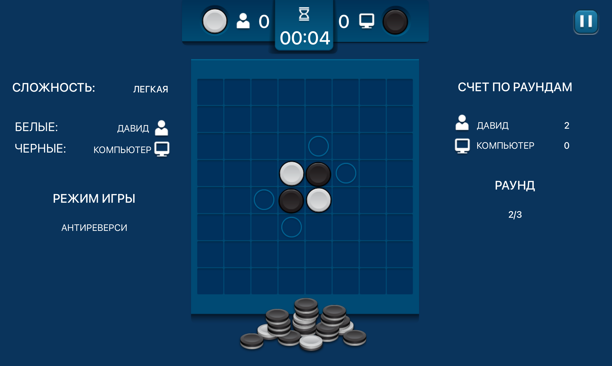

# Reversi Game

Reversi (также известная как Отелло) - это классическая настольная игра для двух игроков с простыми правилами, но глубокой стратегией. Данная реализация включает:

- Игра против компьютера с различными уровнями сложности
- Игра против другого игрока на одном устройстве
- Несколько режимов игры (классический Реверси, Антиреверси, Реверси с черной дырой)
- Система раундов и подсчета очков
- Настраиваемые параметры игры

## Технологический стек

- **Язык программирования**: C++ (стандарт C++20)
- **Мультимедийная библиотека**: SFML 2.6.2 (Simple and Fast Multimedia Library)
  - Графика (sfml-graphics)
  - Аудио (sfml-audio)
  - Окна и ввод (sfml-window)
  - Системные функции (sfml-system)
- **Система сборки**: CMake (версия 3.20+)

## Особенности реализации

- Объектно-ориентированный дизайн
- Модульная структура проекта
- Состояния игры (стек состояний для меню, настроек, игрового процесса)
- Ресурсный менеджер для загрузки текстур и звуков
- Анимации и переходы между экранами

### Требования
- Компилятор C++ с поддержкой C++20
- CMake 3.20+
- SFML 2.6.2

### Инструкции для macOS

1. Установите зависимости через Homebrew:
```bash
brew install sfml@2
```

2. Клонируйте репозиторий:
```bash
git clone https://github.com/yourusername/reversi.git
cd reversi
```

3. Соберите проект:
```bash
mkdir build && cd build
cmake ..
make
```

4. Запустите игру:
```bash
./reversi
```

## Управление

- **Меню**: Используйте мышь для навигации
- **Игровое поле**: Кликните на клетку, чтобы сделать ход
- **Пауза**: Кнопка в углу экрана

## Скриншоты


|Игра против ИИ|Игра против игрока|
|-------------------------|---------------------------------|
|  |  |
|Настройки игры|Настройки поля|
|  |  |
|Конец раунда|Главное меню|
|  |  |

